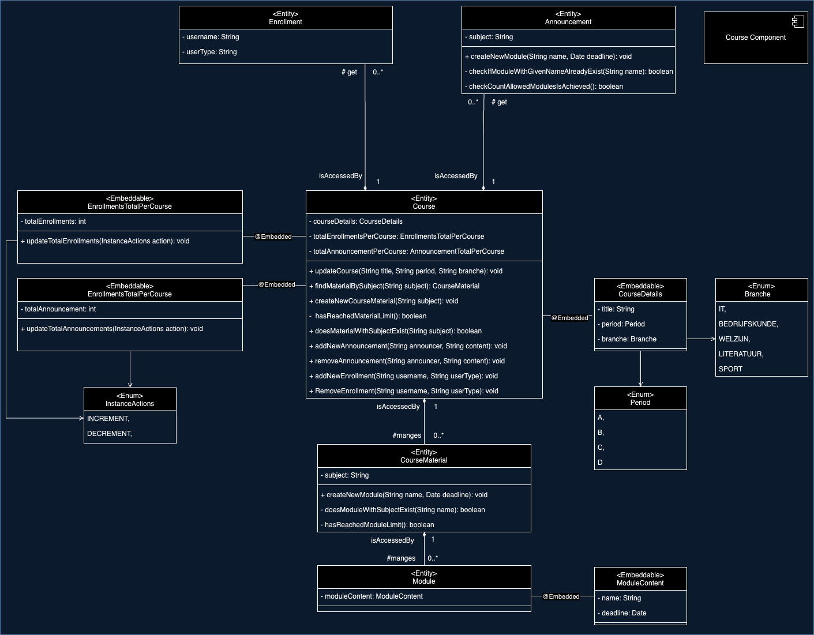
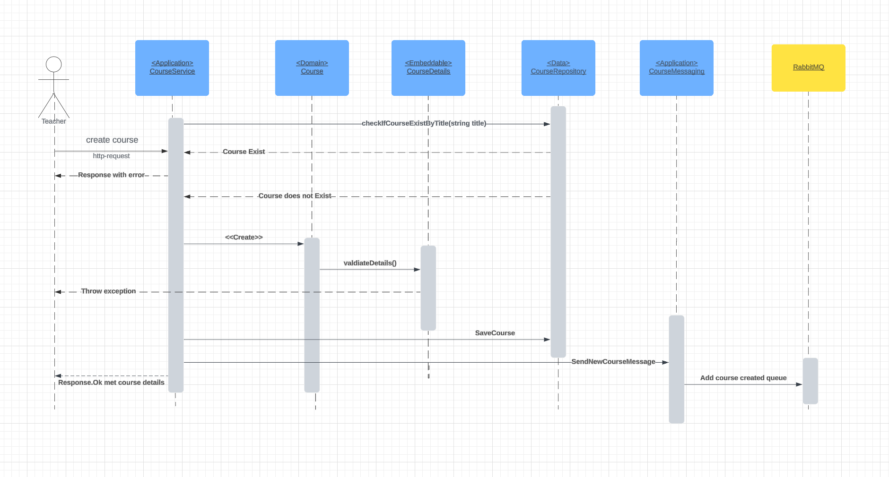
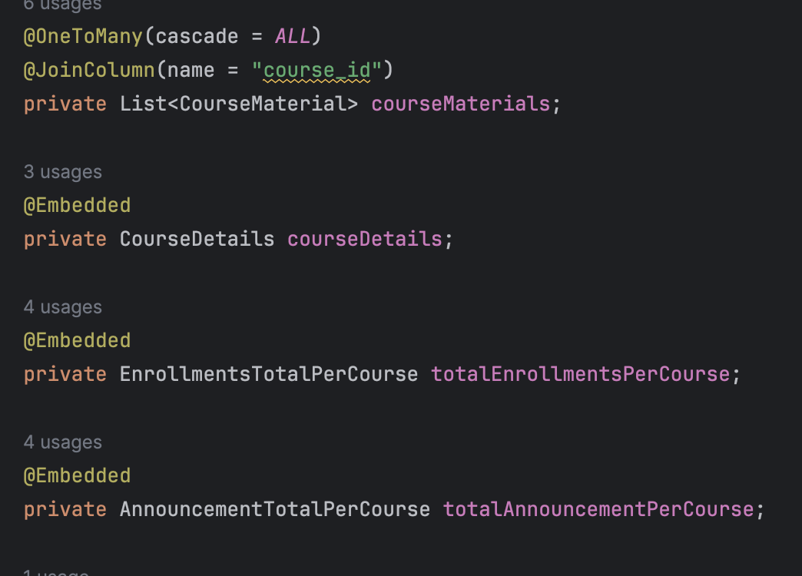

# Course Application

## Domain model

Mijn applicatie heeft de verantwoordelijkheid om CRUD-acties uit te voeren.

Course is verantwoordelijk voor het maken van verschillende materialen. Vervolgens bevat elke material verschillende modulen. 
De relaties naar notificaties en inschrijvingen bevat het minimale gegevens omdat ze op andere servers draaien en course moet up to date blijven met aanpassingen om zich heen.

De embeddable klassen zijn bedoeld om DDD toe te passen met object values. Verder worden de waarden 
niet van buiten de embeddable aangepast. 

De periode en branche zijn gebruikt voor niet CRUD-gebruikersverhalen namelijk aantal courses per branch en aantal courses van specifieke periode.

## Sequence Diagram
De volgende voorbeeld laat de flow zien van het toevoegen van een nieuwe course.~~~~

## Domain-Driven design

Bij het ontwikkelen van de applicaties wordt er rekening gehouden met DDD door:

### Ubiquitous Language
Bij het bedenken aan naamgeving van verschillende properties, wordt er rekening gehouden met de gesproken taal door
domain experts, developers en andere
stakeholders.

Voorbeelden:
- Properties:
- - 
- Functienamen:
- - 

### Entities & Value Objects
Op mijn domain heb ik gebruik gemaakt van Entities en Value Objects met verschillende doelen in de achterhoofd: 

Entities zijn gebruikt bij objecten die ik wil identificeren en beheren gedurende hun levenscyclus en informatie kunnen wijzigen en relatie hebben met andere objecten.

Voorbeeld Course class, Course Material Class, Module Class. 

Value Objects zijn toegepast met verschillende gegevens van course en van module. 
De nut van Value Objects: 
- Value Objects worden vergeleken op basis van hun inhoud, niet op basis van een identificerende sleutel. Als twee Value Objects dezelfde attribuutwaarden hebben, worden ze als gelijk beschouwd, zelfs als het verschillende instanties zijn. Dit betekent dat de equals-methode in de klasse van het Value Object de vergelijking op inhoudelijke gelijkheid mogelijk maakt, waardoor objecten nauwkeurig kunnen worden vergeleken.
- Value Objects zijn meestal onveranderlijk, wat betekent dat ze niet kunnen worden gewijzigd nadat ze zijn gemaakt. In de CourseDetails-klasse zijn de attributen title, period, branche en createDate alleen toegankelijk via getters en worden ze gevalideerd tijdens de constructie van het object. Dit betekent dat eenmaal gecreëerde CourseDetails-instanties consistent en onveranderlijk blijven.
- Value Objects benadrukken de betekenis van de gegevens die ze representeren. In de CourseDetails-klasse geven de attributen title, period, branche en createDate betekenis aan de eigenschappen van een cursus. Dit maakt de code begrijpelijker en verbetert de communicatie tussen teamleden.
- Value Objects kunnen worden samengesteld uit andere Value Objects en kunnen zelfs worden gebruikt als attributen van andere entities of Value Objects. 

### Aggregates
Aggregate Root is goed toegepast omdat het de Course-entiteit als de hoofdentiteit definieert waarmee alle gerelateerde entiteiten, zoals materialen en modulen, worden samengevoegd. 
Dit betekent dat alle acties met betrekking tot materialen en modulen worden beheerd via de Course-entiteit, waardoor de consistentie van gegevens binnen een cursus wordt gewaarborgd.

Een repository die alle entities van cursus behandeld wat levert data consistency wel met losse transacties.

## CAP
Ik heb gekozen voor Availability boven Consistency, maar ik heb toch mijn best gedaan om andere nodes redelijkerwijs consistent te houden. Mijn applicatie blijft functioneren, zelfs als andere nodes zijn uitgevallen, bijvoorbeeld bij het uitvoeren van een verwijderfunctie. Als een van de andere nodes niet functioneert, ga ik toch door met het verwijderen van gegevens.
Om altijd bijgewerkte gegevens van andere nodes te ontvangen, luister ik naar notificaties of inschrijvingen via messaging. Op deze manier heb ik altijd recente gegevens beschikbaar als ik ze nodig heb.
Om ervoor te zorgen dat andere nodes ook worden bijgewerkt, stuur ik een bericht wanneer ik een cursus maak of verwijder. Daarnaast heb ik een extra controle ingebouwd die een bericht stuurt als er een notificatie of inschrijving wordt gedaan voor een verwijderde cursus. Op die manier voorkom ik inconsistenties in de gegevens en zorg ik ervoor dat het systeem blijft functioneren, zelfs als er knooppunten uitvallen.

## Non-triviale usecase
Voor een non-triviale usecase heb ik twee functies gemaakt de ene haalt cursussen gegroepeerd bij studietype
of hoeveel cursussen zijn er gemaakt voor elke blok van het jaar.

## Messaging 
Messaging zijn gebruikt op verschillende wijzen: 

Publisher: Ik verzend een bericht naar subscribers bij gevallen zoals: nieuwe course is toegevoegd, course is verwijderd, of course bestaat niet. 
Subscriber: Ik luister naar berichten wanneer een notificatie of inschrijving zijn aangemaakt of verwijderd en vervolgens voer ik een actie daarmee.

## RPC 
Gebruik ik wanneer een directe response nodig is om verder te gaan met acties namelijk wanneer ik een course wil verwijderen dan wil ik direct een versie van alle notificaties en inschrijvingen die daarbij horen.

